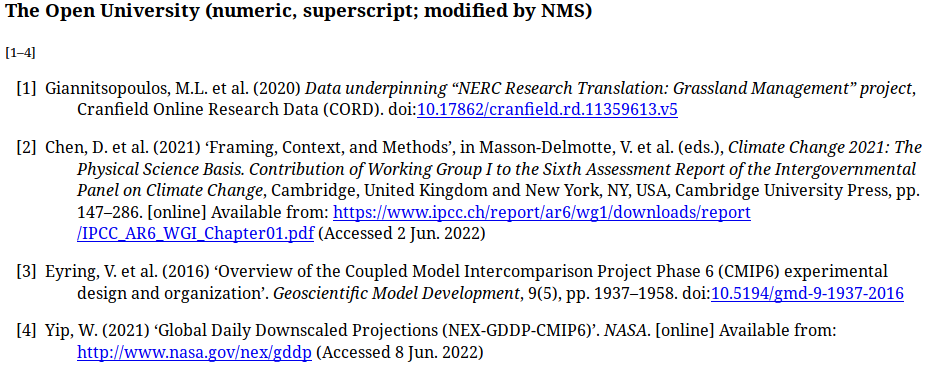

# csl-custom-styles

Custom citation styles. Modified by Nithiya Streethran (nmstreethran@gmail.com) for personal use.

## Styles

1.  The Open University (numeric, superscript) - modified

    See the [modifications to the original style](https://github.com/nmstreethran/csl-custom-styles/compare/0afd62c..03e72f6).

    

## Credits

- <https://citationstyles.org/>
- <https://github.com/citation-style-language/styles>

## License

All styles in this repository are released under the [Creative Commons Attribution-ShareAlike 3.0 Unported license](https://creativecommons.org/licenses/by-sa/3.0/). For attribution, any software using CSL styles from this repository must include a clear mention of the CSL project and a link to <https://citationstyles.org/>. When redistributing styles, the listings of authors and contributors in the style metadata must be kept as is.
